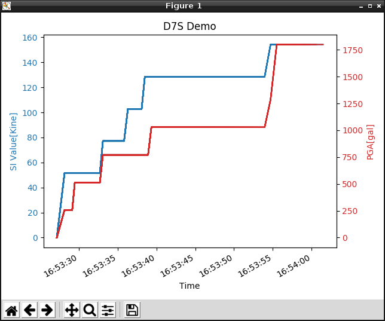

# d7s-grove-raspberrypi
It is a module for evaluating Omron sensor D7S with Raspberry Pi 3 Model B and a sample program when using a module.

D7S is the world's smallest class seismic sensor.
By adopting the SI value highly correlated with the seismic intensity class indicating the magnitude of the earthquake, it is possible to make a highly accurate earthquake judgment according to the seismic intensity class.
It is also possible to acquire earthquake related information in the sensor with the I2C interface.

## language
- [English](./README.md)
- [Japanase](./README_ja.md)

## Description
- grove_d7s.py  
Driver module for acquiring data from D7S via GrovePi+.

- sample_d7s.py  
It is a sample program that allows you to check the data acquired via the driver module on the console.

- sample_gui_d7s.py  
It is a sample program that enables you to visualize and check the data acquired via the driver module with graphs.

***DEMO:***  
When you run sample_gui_d7s.py, you can see the following graph.  



## Installation
1. It is necessary to install dependency software beforehand.  
    [Dependencies](#link)
2. Open Terminal and execute the following command.    
    ```
    $ mkdir omron_sensor
    $ git clone https://github.com/omron-devhub/d7s-grove-raspberrypi.git
    ```

## Usage
Procedure to operate the sample program.
-  sample_d7s.py  
Open Terminal and execute the following command.  
    ```
    $ cd omron_sensor
    $ sudo python3 sample_d7s.py
    ```
- sample_gui_d7s.py  
Open Terminal and execute the following command.  
    ```
    $ cd omron_sensor
    $ sudo python3 sample_gui_d7s.py
    ```

## Dependencies
d7s-grove-thinkerboard requires the following dependencies:
- [Python3](https://www.python.org/)
- [GrovePi+](http://wiki.seeedstudio.com/GrovePi_Plus/)
- [matplotlib](https://matplotlib.org/)
- [smbus2](https://pypi.org/project/smbus2/)

## Licence
Copyright (c) OMRON Corporation. All rights reserved.

Licensed under the MIT License.
